# Final Project Autonomous Mobile Robots

Author: Piotr Gapski

To jump into this project refer to the examples from the ROS [Documentation](http://wiki.ros.org/Documentation).
The source code doesn't include any third-party library.

> This repository contains the final program in the course - Autonomous Mobile Robots.
> The main purpose of this project is to reach randomly located points by 
> autonomously moving robot. without any help in control. Implemented algorithms are
> considered to work properly regardless of spawned map. Gazebo attepmts to simulate
> the real world in a real physics conditions.

</br>
<p align="center">

</p>
</br>


## Getting Started

[Installation Guide](http://wiki.ros.org/ROS/Installation)

In order to launch this project the following commands are necessary to type in:

### Run ROScore

Roscore is a collection of nodes and is required in order to communicate with them in ROS.

```sh
$ roscore
```

### Launch Gazebo

This command spawns turtlebot in an empty world.

```sh
$ roslaunch turtlebot3_gazebo turtlebot3_empty_world.launch
```

### Add some objects to the world

Add customized objects, make sure that "construction_cone" and "fast_food" are included.

```sh
$ rosrun gazebo_ros spawn_model -file /home/piotr/catkin_ws/src/pg-192167_tier4/final_project_practice/model.sdf -sdf -x 2 -y 1 -model mini_project
```

### Publish goals

A publisher is a node that sends messages to the topic. It can be used for communication purposes or in nodes controlling.

```sh
$ roslaunch goal_publisher goal_publisher.launch config_file:=<project_path>/final_project_practice/practice_goals.yaml
$ roslaunch goal_publisher goal_publisher.launch config_file:=/home/piotr/catkin_ws/src/pg-192167_tier4/final_project_practice/practice_goals.yaml
```

### Launch the project

```sh
$ roslaunch pg_192167_prj start.launch
```

## Description of the topics

| Topic                  | Message                     |
| ---------------------- | --------------------------- |
| `/gazebo/model_states` | `gazebo_msgs/ModelStates`   |
| `/goals`               | `goal_publisher/PointArray` |
| `/laserscan`           | `LaserScan`                 |
| `/clock`               | `rosgraph_msgs/Clock`       |
| `/cmd_vel`             | `geometry_msgs/Twist`       |

1. `/gazebo/model_states` - refers to the actual position of the robot.
2. `/goals` - publishes coordinates to the main program to get all goals.
3. `/laserscan` - calculates distance between obstacles and the robot.
4. `/clock` - additional timer in project.
5. `/cmd_vel` - publishes the speed of the robot.

## Source python files

#### 1. goal_subscriber

This file includes a class "goal_subscriber" with functions to subscribe goals and recive messages. Lastly it checks whether an array with goals has been sent.

#### 2. vel_publisher

This file includes a class "vel_publisher" with functions to publish the velocity of a robot. There are two different types of speed and one function to stop the robot.

- Linear motion - defines movement of the robot in a straight line.
- Angular velocity - defines the angular speed of the robot.

#### 3. goto_point

This file consists functions necessary to calculate distance between actual position of the robot and the following goal. Function "move" is responsible for robot's movement untill the goal is reached.

#### 4. follow_obstacle

The most complex part of this project.
A laser scanner is devided into 5 regions.

There are 3 possible states (pertains to the finite-state machine):

- Find an obstacle on the way to the goal.
- Turn left (if an obstacle is detected)
- Follow the obstacle (untill coordination is possible to achive)

Every combination is defined in "if statement". Laser scanner checks regions and returns the distance value between an obstacle and the robot. If the laser doesn't detect any obstacle, then it starts focusing on the goal once again.

#### 5. pg_192167_prj

This main file includes all created classes. Program checks what is the recent state of the robot and runs in a while loop untill all goals are reached. If there is an obstacle in front of the robot, it changes its present state into object detection. (timer provides auto reset if the obstacle is impossible to pass by) The robot automatically calculates the closest obstacle. If there is nothing in front of the robot, it moves constantly forward. Otherwise robot maybe stucked in a infinity loop and will be reset after a certain period of time. Every goal is reached in precision of 0.5m,at this time robot stops and afterwards moves to the next coordinates from array.

### Common error

RLException: [start.launch] is neither a launch file in package [pg_192167_prj] nor is [pg_192167_prj] a launch file name

RLException: [goal_publisher.launch] is neither a launch file in package [goal_publisher] nor is [goal_publisher] a launch file name


Solution:

```sh
$ source <path>/catkin_ws/devel/setup.bash

$ source /home/piotr/catkin_ws/devel/setup.bash

```

### Algorithms implementation

- FSM
- Bug 2

Description of my work is included in the presentation

### Presentation

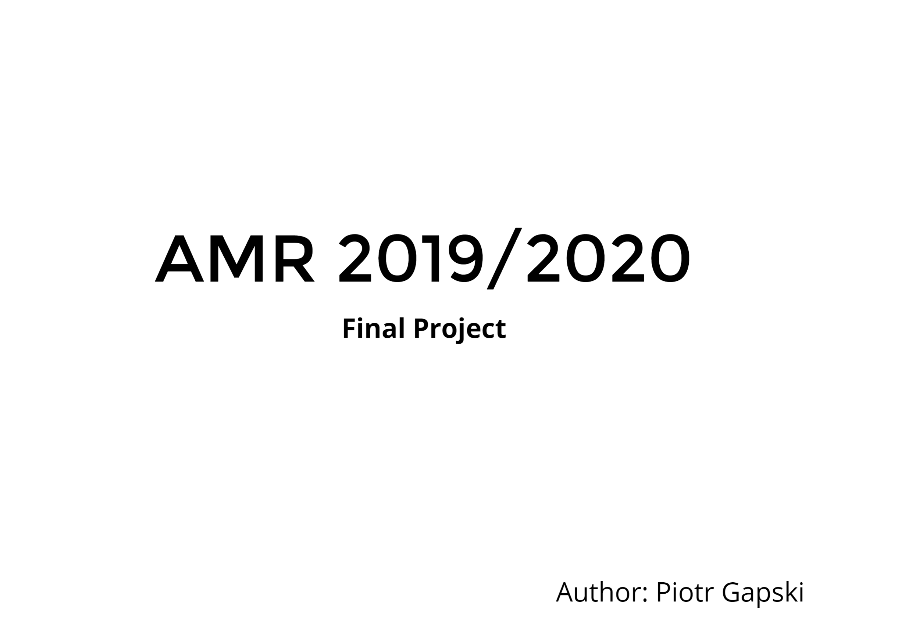
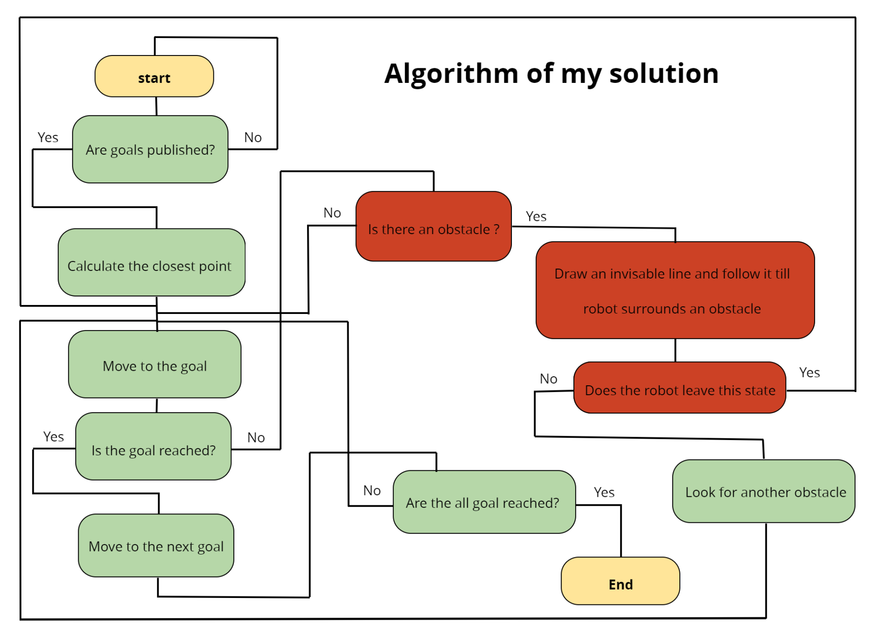
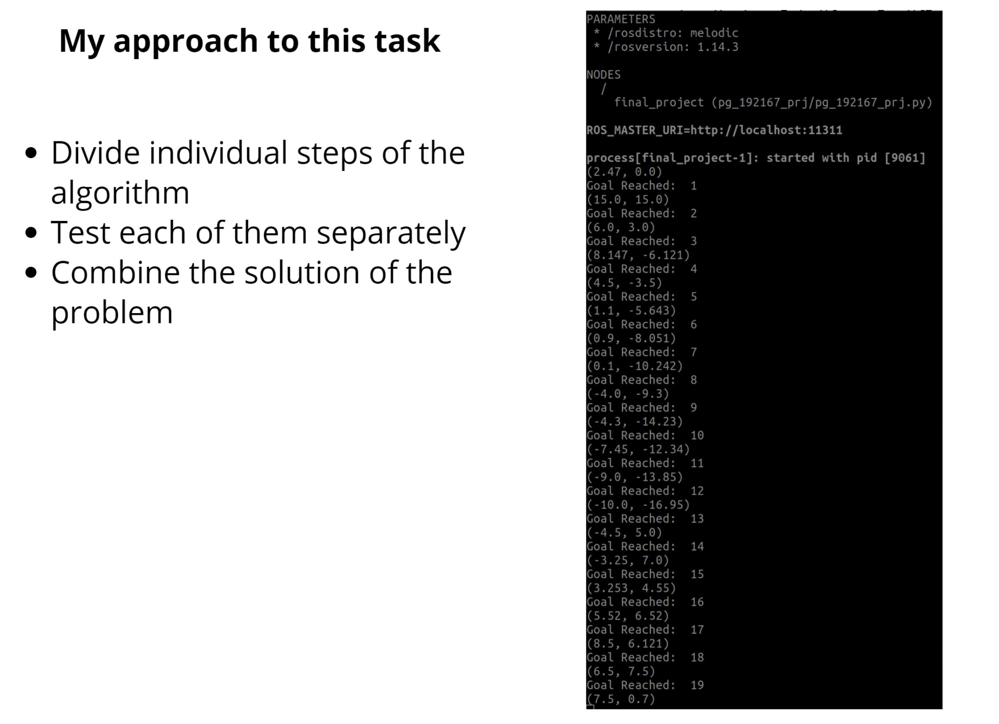
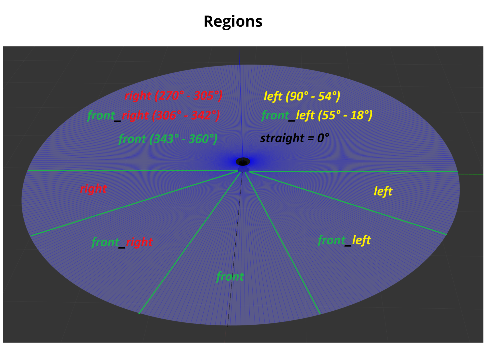
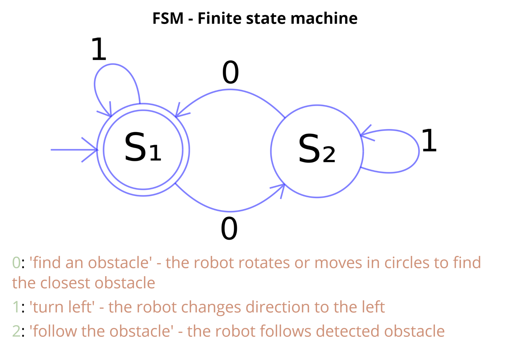
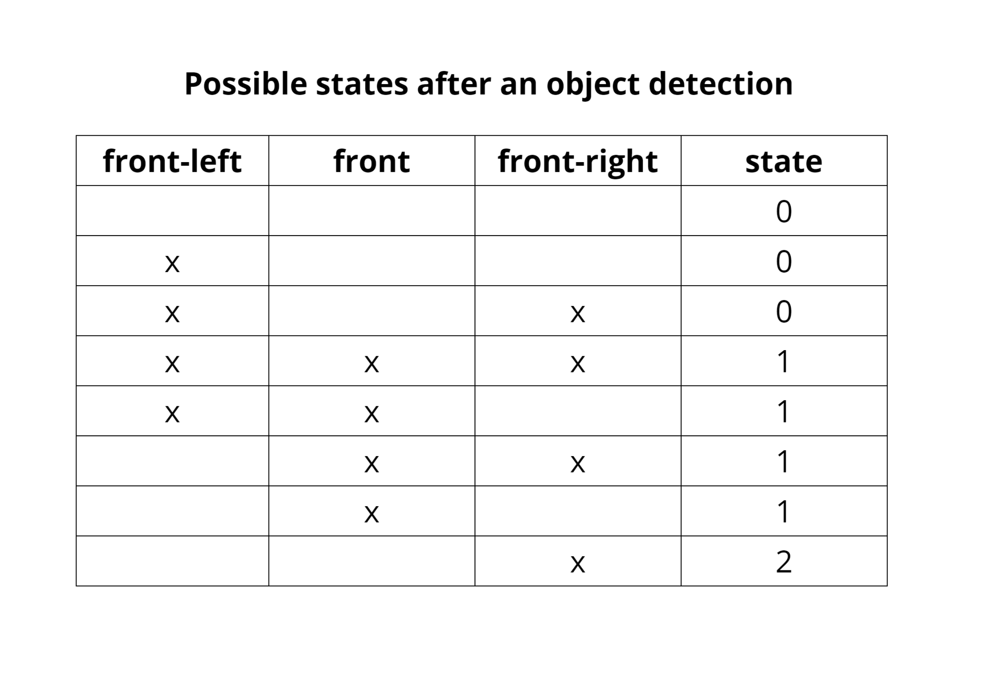
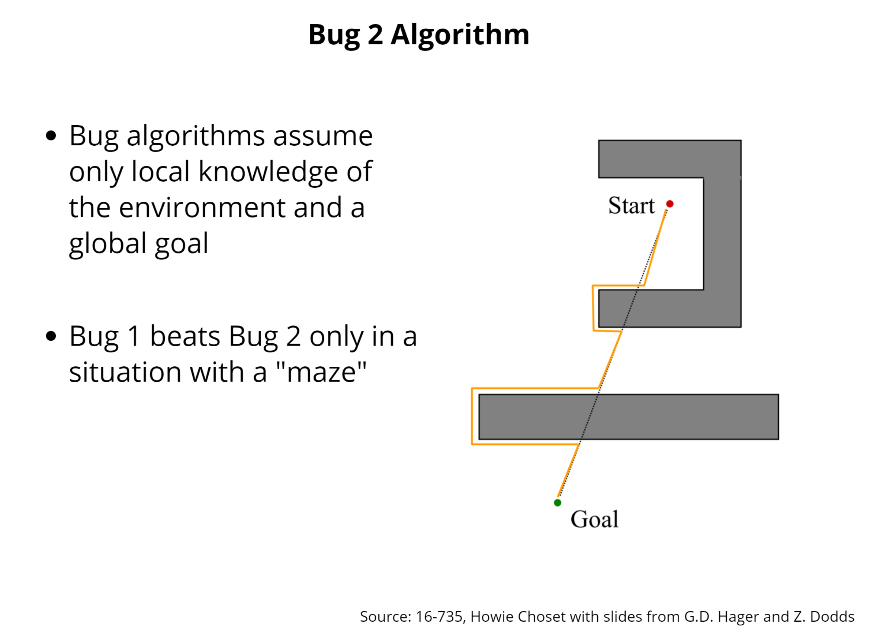
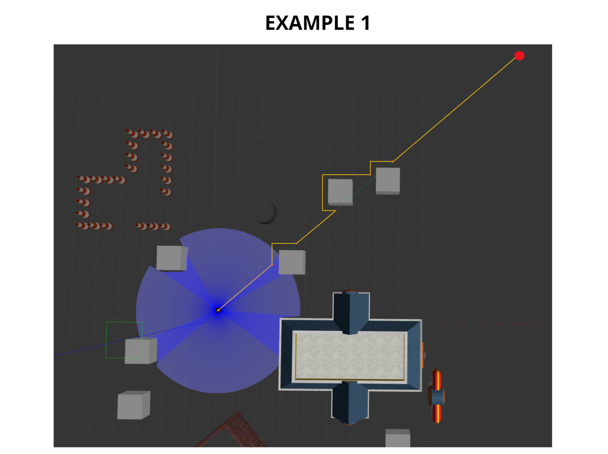
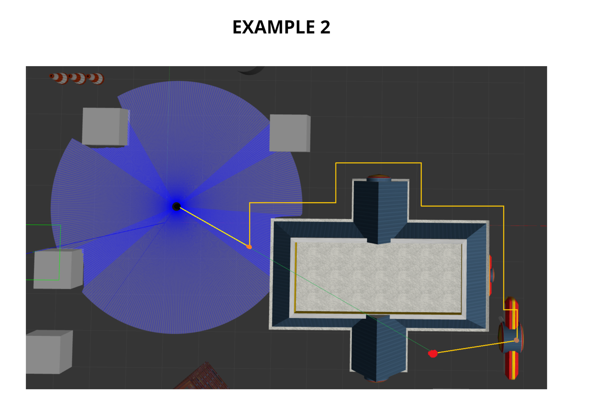
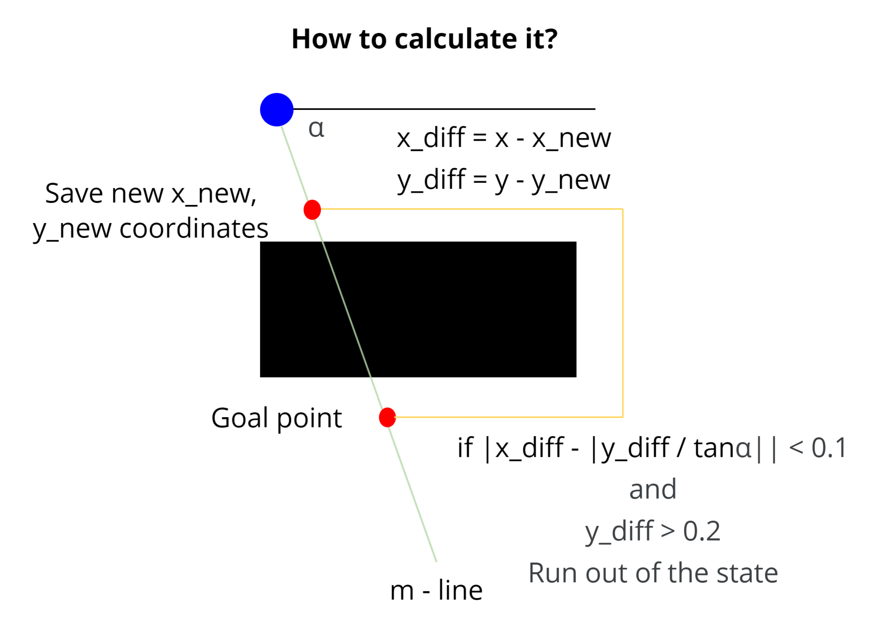
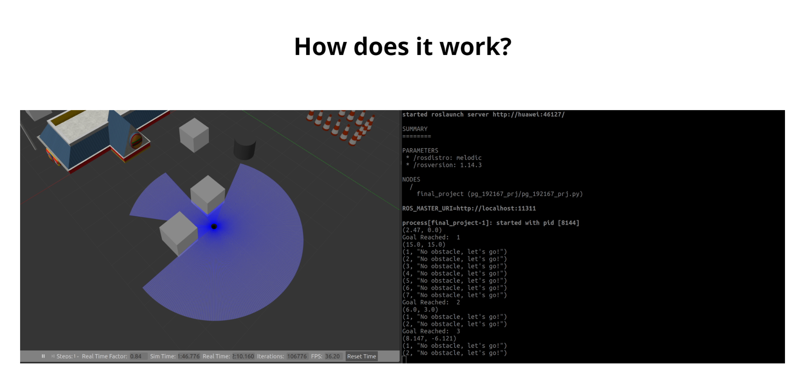

### All commands

| Commands                                                                                                                              |
| ------------------------------------------------------------------------------------------------------------------------------------- |
| roslaunch turtlebot3_gazebo turtlebot3_empty_world.launch                                                                             |
| rosrun gazebo_ros spawn_model -file ~/catkin_ws/src/ml-161927_tier3/data/model.sdf -sdf -x 2 -y 1 -model mini_project                 |
| roslaunch turtlebot3_teleop turtlebot3_teleop_key.launch                                                                              |
| catkin_create_pkg <name_of_package> rospy                                                                                             |
| rospack list                                                                                                                          |
| roscd <package_name>                                                                                                                  |
| chmod +x <name_of_python_file.py>                                                                                                     |
| roslaunch <package_name> <launch_file_name>                                                                                           |
| rosnode list                                                                                                                          |
| rosnode info / <name>                                                                                                                  |
| rosmsg show <name_of_the_message>                                                                                                     |
| rosmsg show geometry_msgs/Twist                                                                                                       |
| rostopic list                                                                                                                         |
| rostopic info <name_of_the_topic>                                                                                                     |
| rostopic echo <name_of_the_topic>                                                                                                     |
| rostopic pub /mobile_base/commands/velocity geometry_msgs/Twist '{linear: {x: 0.1, y: 0.0, z: 0.0}, angular: {x: 0.0,y: 0.0,z: 0.0}}' |
| cd ~/catkin_ws with catkin_make                                                                                                       |
| source ~/catkin_ws/devel/setup.bash                                                                                                   |
